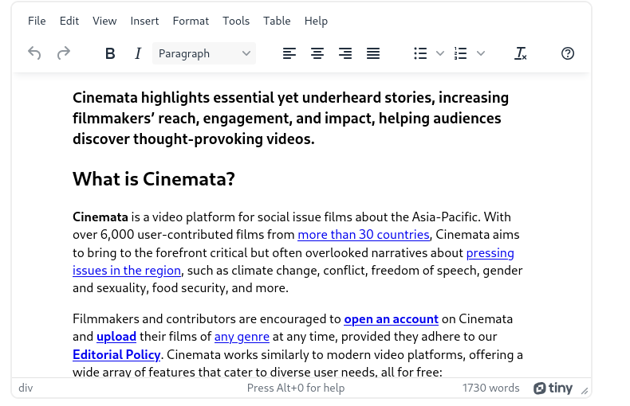

# Cinemata Rich Text Editor Guide

This guide explains how to work with the new TinyMCE rich text editor. 

## Overview

TinyMCE is a well-maintained rich text editor that allows users to easily create formatted content in a friendly interface. The current configuration of TinyMCE in Cinemata presents a familiar menu bar with frequently used tools placed in a toolbar below the menubar. 

## Usage

To get started, you can type your content in the editor area under the toolbar. TinyMCE will convert your content into sanitized HTML that will be rendered on the pages you're editing. 

### Toolbar Items

Several useful tools are enabled in the toolbar to help with editing. From left to right, they are
1. Undo/Redo - Allows you to undo an edit or redo a previous edit
2. Bold/Italicize - sets the selection to bold/italics
3. Block Selection - changes the HTML tag (h1, h2, etc...) used for the selected content
4. Alignment - allows changing the alignment of the content near the cursor
5. Bullet list/Numbered list - clicking this allows inserting a bulleted list (ul) or a numbered list (ol)
6. Clear formatting - Remove any styling from the selection. Note that clearing the formatting does not change the HTML tag of the content, but only things like italicization and bold face
7. Help - Shows some shortcuts that can be used in the editor

### Menu Items

The configured TinyMCE editor also contains a menu bar featuring some useful tools. Some of the most useful tools are:
- HTML Preview - Found in File -> Preview or View->Preview. Allows you to show the resulting rendered HTMl. Note that the preview shows only the HTML and not the css styles that will be applied to the content when rendering.
- Source Code - Found in View->Source code. Allows you to edit the raw html of the text.
- Show Blocks - Found in View->Show blocks. Lets you see the HTML tags being used when your content is rendered to HTML.
- Insert menu - You can insert a variety of media in your rich text without having to code the content in raw HTML. 
- Table menu - Allows you to insert an HTML table

## Configuration

The TinyMCE editor is easily configurable. The current configuration can be found in TINYMCE_DEFAULT_CONFIG of `cms/settings.py`. You may consult this  and the TinyMCE  for configuration options. The configuration process usually involves looking at the TinyMCE documentation config options and copying them verbatim in the TINYMCE_DEFAULT_CONFIG variable. 